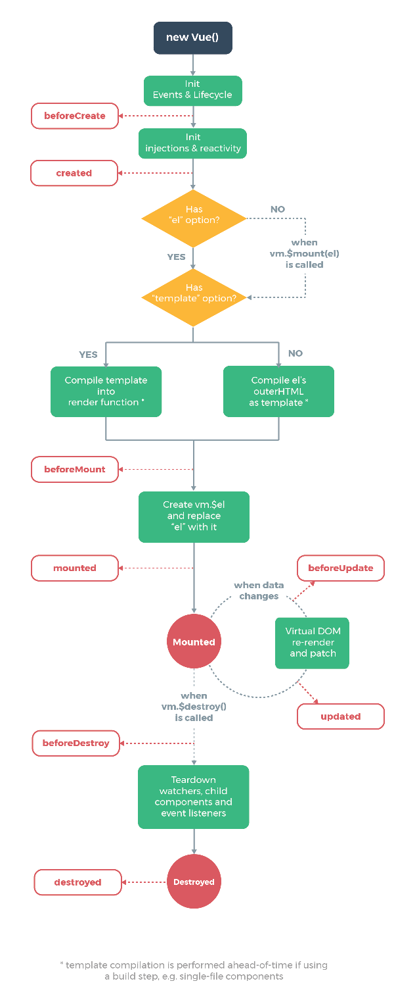

# 뷰의 반응형 시스템에 관한 문서
```
https://kr.vuejs.org/v2/guide/reactivity.html
```

# 연락처서비스 API
```
http://sample.bmaster.kro.kr/
```

# el, data, computed 옵션
## el
el 옵션은 Vue 인스턴스에 연결할 HTML DOM 요소를 지정한다.
주의할 점은 여러 개 요소에 지정할 수 없다는 것이다.
만약 여러개 요소가 있다면 첫번째 요소가 선택된다.

## 동적으로 el 연결
vm.$mount('#id')와 같이 동적으로 연결할수 있다.
가능하다면 vue인스턴스를 생성할 때 미리 지정할 것을 권장 한다.
vue인스턴스가 html요소와 연결되면 도중에 연결된 요소를 변경할 수 없기 때문이다.

## vue 인스턴스 객체에 data 접근 방법
vm.$data.name 과 같이 vm(뷰객체)에 $data 로 접근한다.

## computed 함수에 접근하는법
vm.sum
vm.$options.computed.sum

# 메서드
## 메서드와 계산형 속성의 차이
최종적인 결과물은 같아 보이지만 내부 작동 방식에는 차이가 있다.
계산형 속성은 종속된 값에 의해 결괏값이 캐싱된다는 점이다.
예제 03, 04 번을 vmSum.sun(), vmSum.sum 을 각각 콘솔에 입력시.
캐싱되는 vmSum.sum은 날짜를 출력하지 않는것을 확인 할 수 있다.

## 메서드 작성시 주의점
화살표함수 내부에서는 this가 vue 인스턴스를 가리키지 않고 전역객체를 가리키기 때문에 사용하는 것을 지양한다.

# 관찰 속성
## watch
하나의 데이터를 기반으로 다른 데이터를 변경할 필요가 있을 때 흔히 사용 할 수 있는 것으로 계산형 속성이 있지만 이외에도 관찰 속성이라는 것이 있다. 주로 긴 처리 시간이 필요한 비동기 처리에 적합하다는 특징이 있다. 매번 값이 바뀔 때마다 함수가 호출 된다.

## watch와 computed의 차이점
아직... 잘 모르겠다...
비동기라면 watch 동기라면 computed 라는데.. 뭔 개솔??..

# v-cloak 디렉티브
예제 08번

# Vue 인스턴스 라이프 사이클
(참고 이미지) Vue의 라이프 사이클 

## beforeCreate
Vue 인스턴스가 생성되고 데이터에 대한 관찰 기능 및 이벤트 감시자 설정 전에 호출된다.

## created
Vue 인스턴스가 생성된 후에 데이터에 대한 관찰 기능, 계산형 속성, 메서드, 감시자 설정이 완료된 후에 호출.

## beforeMount
마운트가 시작되기 전에 호출된다.

## mounted
el에 vue인스턴스의 데이터가 마운트된 후에 호출된다.

## beforeUpdate
가상 DOM이 렌더링, 패치되기 전에 데이터가 변경될 때 호출된다.
이 훅에서 추가적인 상태 변경을 수행할 수 있다. 하지만 추가로 다시 랜더링 하지 않는다.

## updated
데이터의 변경으로 가상 DOM이 다시 렌더링되고 패치된 후에 호출된다. 이 훅이 호출되었을 때는 이미 컴포넌트의 DOM이 업데이트된 상태이다. 그래서 DOM에 종속성이 있는 연산을 이 단계에서 수행할 수 있다.

## beforeDestroy
Vue 인스턴스가 제거되기 전에 호출된다.

## destroyed
Vue 인스턴스가 제거된 후에 호출. 이 훅이 호출될 때는 Vue 인스턴스의 모든 디렉티브의 바인딩이 해제되고, 이벤트 연결도 모두 제거 된다.